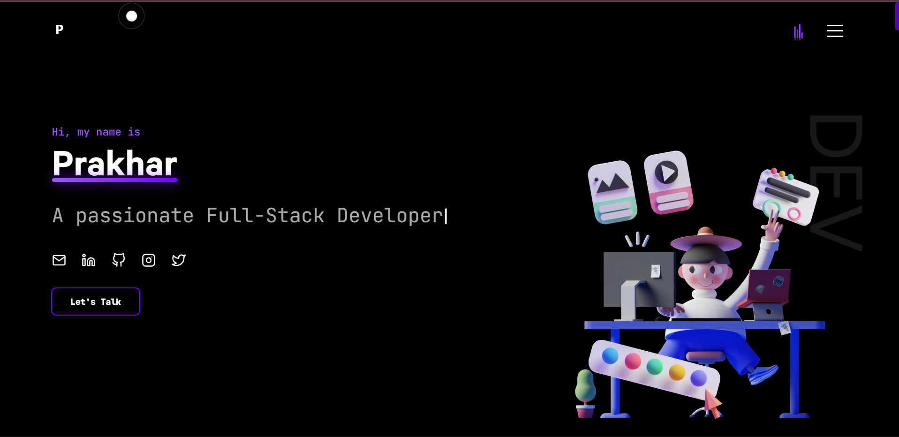

# Portfolio | Prakhar

  
  

👨‍🎓 A passionate Full-Stack Developer, dedicated to building modern web applications and solving real-world problems with code.

### ✨ [GitHub Profile](https://github.com/paradox-prakhar)

## 💻 Tech Stack
- **Languages & Tools:** HTML, CSS, JavaScript, TypeScript, Sass, Node.js, Webpack, Vite, Firebase, Figma, Tanstack
- **Libraries & Frameworks:** React, Next.js, TailwindCSS, Styled Components
- **Databases:** MySQL, MongoDB
- **Other:** Git, Cursor, Sanity

## 🚀 Projects
- **[CampusChoice](https://github.com/paradox-prakhar/CampusChoice):** Helping students make the right campus decisions 🎓
- **[CarbonView](https://github.com/paradox-prakhar/carbonview):** Track and visualize carbon emissions 🌿
- **[SRM System](https://github.com/paradox-prakhar/srm-system):** Student resource management made easy 📚
- **[Tic-Tac-Toe](https://github.com/paradox-prakhar/Tic-tac-toe):** Classic game with a modern twist 🎮

## 📬 Connect with me
- [LinkedIn](https://www.linkedin.com/in/prakhar-raj007/)
- [GitHub](https://github.com/paradox-prakhar)
- [Twitter / X](https://x.com/CHOTURAj007)
- [Instagram](https://www.instagram.com/_paradox_prakhar/)
- [Email](mailto:007prakharraj@gmail.com)

## Getting Started

In the project directory, you can run:

#### `bun install`

#### `bun dev`

Runs the app in the development mode.\
Open [`http://localhost:3000`](http://localhost:3000) to view it in the browser.
